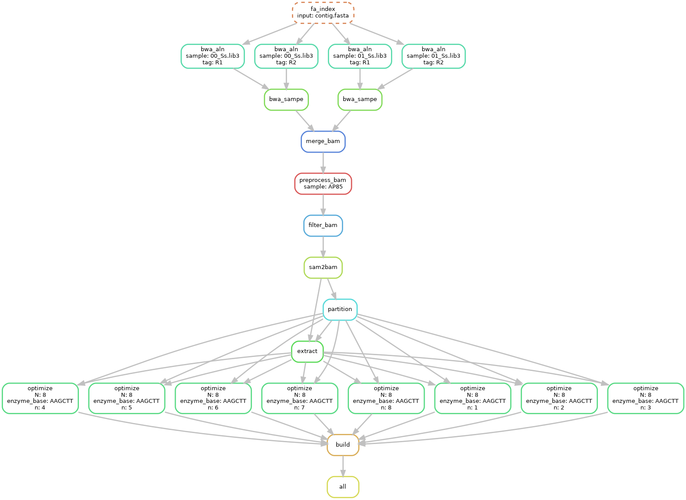

## **snakemake pipeline for run ALLHiC diploid assembly**




- configure
`vim config_allhic_diploid_pipeline.yaml`
```yaml
## configure file of allhic snakemake pipeline
## contig level fasta file
genome:
        contig.fasta

## output file prefix
sample:
        - AP85
## threads of program
ncpus:
        12

## restriction enzyme of Hi-C ["HindII", "MboI"]
enzyme:
        HindIII

## number of cluster group
cluster_N:
        8

## tag for fastq file 
tag:
        - R1
        - R2
## suffix for fastq file
fq_suffix:
        fastq.gz
```

- prepare fastq data

```bash
## create data dir and restore fastq into data directory
mkdir data && cd data
ln -s *fastq.gz .
```
- execute snakemake in command line or submit into cluster
```
snakemake -j 12 -s allhic_diploid_pipeline.smk --configfile config_allhic_diploid_pipeline.yaml --cluster "qsub -l select=1:ncpus={thread} -q workq -j oe"
```
