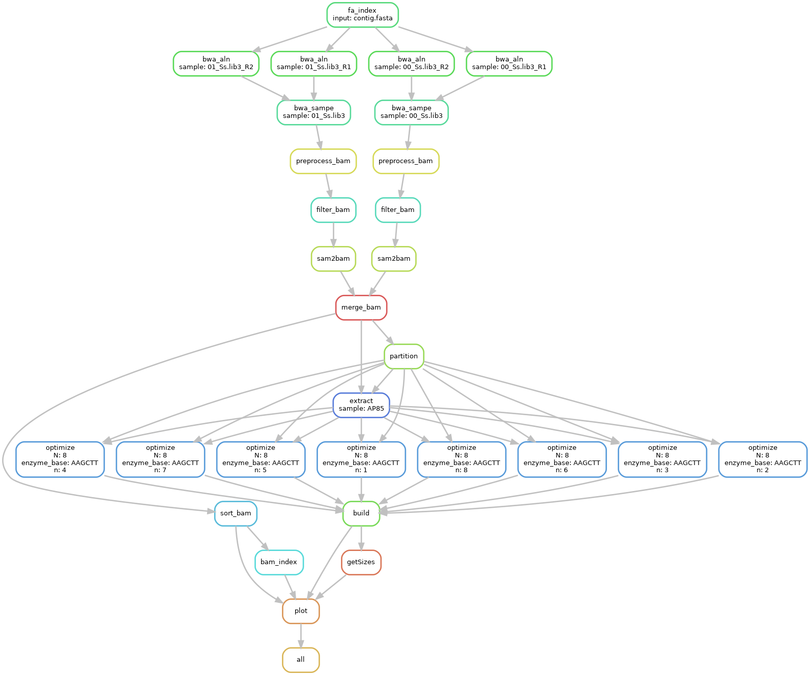
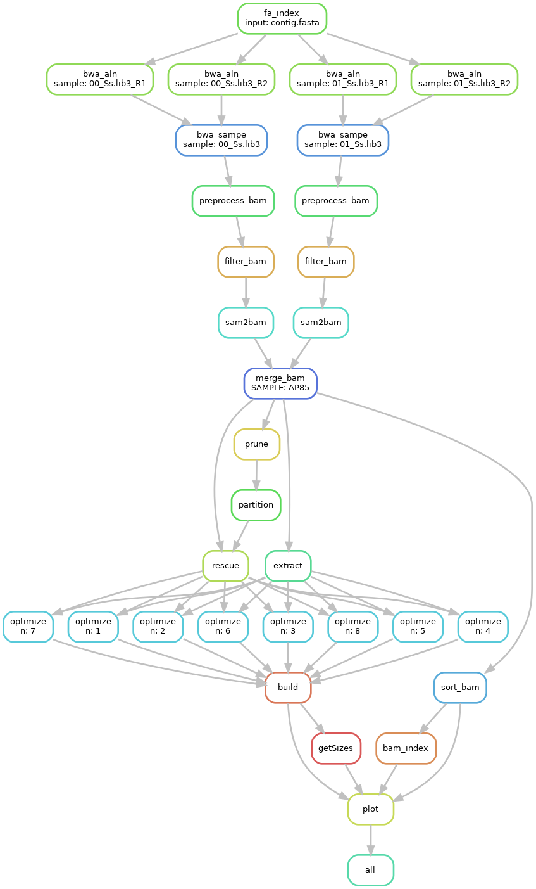

# **snakemake pipeline for run ALLHiC**

## dependency
- [`TDGP`](https://github.com/wangyibin/TDGP)
- [`python >=3.5`](https://python.org)
- [`snakemake`](https://snakemake.readthedocs.io/en/stable/getting_started/installation.html)
- [`ALLHiC`](https://github.com/tangerzhang/ALLHiC)
- [`pysam`](https://github.com/pysam-developers/pysam)


## install
```bash
export PYTHONPATH=/path/to/TDGP:$PYTHONPATH
export PATH=/path/to/TDGP/bin:/path/to/TDGP/utils:$PATH
export PATH=/path/to/ALLHiC/bin:/path/to/ALLHiC/scripts:$PATH
cp /path/to/allhic_diploid_pipeline.smk .
cp /path/to/config_allhic_diploid_pipeline.yaml .
```
- split fastq
split fastq file to run pipeline of allhic

```bash
splitFastq R1.fastq.gz R2.fastq.gz -n 1000000 -t 12
```
## **snakemake pipeline for run ALLHiC diploid assembly**
> This pipeline only support for allhic to assemble diploid


- prepare fastq data

```bash
## create data dir and restore fastq into data directory
mkdir data && cd data
ln -s *fastq.gz .
```
- configure
`vim config_allhic_diploid_pipeline.yaml`
```yaml
## configure file of allhic snakemake pipeline
## contig level fasta file
genome:
        contig.fasta

## output file prefix
sample:
        - AP85
## threads of program
ncpus:
        12

## restriction enzyme of Hi-C ["HindII", "MboI"]
enzyme:
        HindIII

## number of cluster group
cluster_N:
        8
## bin sizes of heatmap plotting
bin_sizes:
        - "150K"
        - "500K"
## tag of fastq file 
tag:
        - R1
        - R2
## suffix of fastq file
fq_suffix:
        fastq.gz
```


- execute snakemake in command line or submit into cluster
  
        ## - Torque or PBSPro
  
        ```bash
        snakemake -j 12 -s allhic_diploid_pipeline.smk --configfile config_allhic_diploid_pipeline.yaml --cluster "qsub -l select=1:ncpus={threads} -q workq -j oe"
        ```
        ## - SGE
        ```bash
        snakemake -j 12 -s allhic_diploid_pipeline.smk --configfile config_allhic_diploid_pipeline.yaml --cluster "qsub -j oe -pe mpi {threads} -cwd -S /bin/bash"
        ```
        ##  - Command line
        ```bash
        snakemake -j 12 -s allhic_diploid_pipeline.smk --configfile config_allhic_diploid_pipeline.yaml
        ```

## **snakemake pipeline for run ALLHiC polyploid assembly**

- prepare fastq data and Allele.ctg.table

```bash
## prepare allele table follow ALLHiC wiki
cp Allele.ctg.table ./
## create data dir and restore fastq into data directory
mkdir data && cd data
ln -s *fastq.gz .
```
- configure
`vim config_allhic_polyploid_pipeline.yaml`
```yaml
## configure file of allhic snakemake pipeline
## contig level fasta file
genome:
        contig.fasta

## allele table
Allele:
        Allele.ctg.table
## output file prefix
sample:
        - AP85
## threads of program
ncpus:
        12

## restriction enzyme of Hi-C ["HindII", "MboI"]
enzyme:
        HindIII

## number of cluster group
cluster_N:
        8

## whether plot heatmap default true 
plot:
        true
## bin sizes of heatmap plotting
bin_sizes:
        - "150K"
        - "500K"
## tag of fastq file 
tag:
        - R1
        - R2
## suffix of fastq file
fq_suffix:
        fastq.gz
```


- execute snakemake in command line or submit into cluster
  
        ## - Torque or PBSPro
  
        ```bash
        snakemake -j 12 -s allhic_polyploid_pipeline.smk --configfile config_allhic_polyploid_pipeline.yaml --cluster "qsub -l select=1:ncpus={threads} -q workq -j oe"
        ```
        ## - SGE
        ```bash
        snakemake -j 12 -s allhic_polyploid_pipeline.smk --configfile config_allhic_polyploid_pipeline.yaml --cluster "qsub -j oe -pe mpi {threads} -cwd -S /bin/bash"
        ```
        ##  - Command line
        ```bash
        snakemake -j 12 -s allhic_polyploid_pipeline.smk --configfile config_allhic_polyploid_pipeline.yaml
        ```
