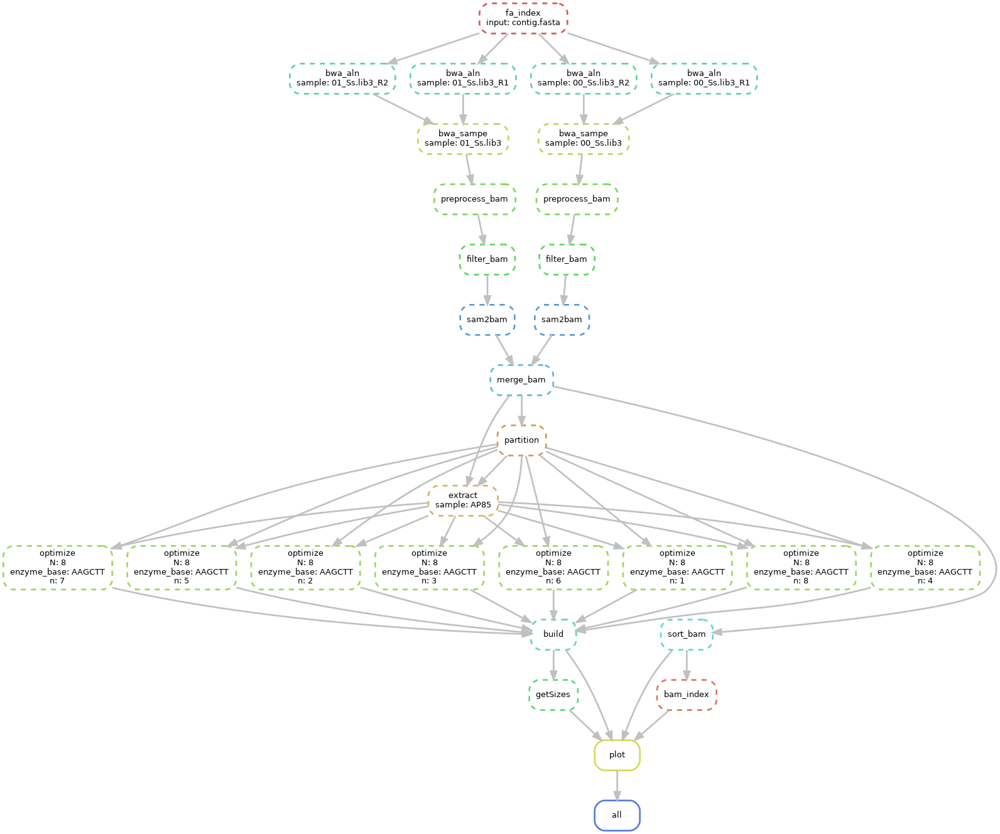

## **snakemake pipeline for run ALLHiC diploid assembly**
> This pipeline only support for allhic to assemble diploid


- install
```bash
export PATH=/path/to/TDGP/bin:/path/to/TDGP/utils:$PATH
export PATH=/path/to/ALLHiC/bin:/path/to/ALLHiC/scripts:$PATH
cp /path/to/allhic_diploid_pipeline.smk .
cp config_allhic_diploid_pipeline.yaml .
```
- split fastq
split fastq file to run pipeline of allhic

```bash
splitFastq R1.fastq.gz R2.fastq.gz -n 1000000 -t 12
```
- configure
`vim config_allhic_diploid_pipeline.yaml`
```yaml
## configure file of allhic snakemake pipeline
## contig level fasta file
genome:
        contig.fasta

## output file prefix
sample:
        - AP85
## threads of program
ncpus:
        12

## restriction enzyme of Hi-C ["HindII", "MboI"]
enzyme:
        HindIII

## number of cluster group
cluster_N:
        8
## bin sizes for heatmap plotting
bin_sizes:
        - "150K"
        - "500K"
## tag for fastq file 
tag:
        - R1
        - R2
## suffix for fastq file
fq_suffix:
        fastq.gz
```

- prepare fastq data

```bash
## create data dir and restore fastq into data directory
mkdir data && cd data
ln -s *fastq.gz .
```
- execute snakemake in command line or submit into cluster
```bash
snakemake -j 12 -s allhic_diploid_pipeline.smk --configfile config_allhic_diploid_pipeline.yaml --cluster "qsub -l select=1:ncpus={thread} -q workq -j oe"
```
