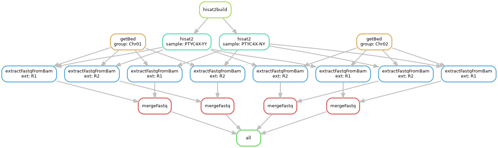
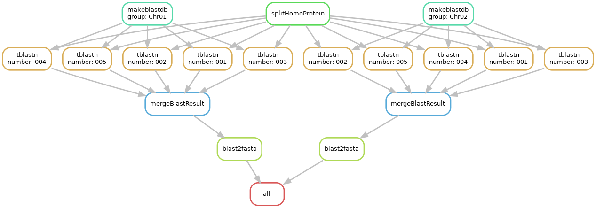

# split genome to annotate by homologous
pipeline to split large genome to serval parts for genome annotation, such as homologous groups.(version 1.2)
## Dependency
- [`seqkit`](https://github.com/shenwei356/seqkit)
- [`python >= 3.5`](https://python.org)
- [`hisat2`](https://github.com/DaehwanKimLab/hisat2)
- [`samtools`](https://github.com/samtools/samtools)
- [`ncbi-blast-2.3`](ftp://ftp.ncbi.nlm.nih.gov/blast/executables/blast+/2.3.0/)
- [`ParaFly`](http://parafly.sourceforge.net/)
- [`parallel`](https://www.gnu.org/software/parallel/)
- [`pigz`](http://zlib.net/pigz/)
- [`snakemake`](https://snakemake.readthedocs.io/en/stable/getting_started/installation.html)
- [`biopython`](https://biopython.org/)
- [`pandas`](https://pandas.pydata.org/)

### split genome
split genome by groups
- requires
    - `groups.db`: two columns
        ```text
        Chr01   Chr01g1
        Chr01   Chr01g2
        Chr02   Chr02g1
        Chr02   Chr02g2
        tig tig000001
        tig tig000002
        tig tig000003
        ```
    - `genome.fasta`: genome fasta
- run
```bash
splitGenomebyGroups.py genome.fasta groups.db
```
### split RNA-Seq data
split RNA-Seq data by groups

- requires
  
    directory of groups from above step

    - `groups.db`
    - `genome.fasta`
    - `data`: RNA-Seq data
        - `sample1_R1.fastq.gz`
        - `sample1_R2.fastq.gz`
        - `sample2_R1.fastq.gz`
        - `sample2_R2.fastq.gz`

- configuration
  
`vim splitRNASeqbyGroups.config.yaml`
```yaml
## genome 
genome: "genome.fasta"

## groups db file, two columns(group\tchrom)
groups: "groups.db"

## number of threads
ncpus: 10

## ext of fastq file 
ext: ['R1', 'R2']
suffix: 'fastq.gz'

## parameters of hisat2 
hisat2_k: 4
```
- run
```bash
 snakemake -s splitRNASeqbyGroups.smk --configfile splitRNASeqbyGroups.config.yaml -j 10 --cluster "qsub -l nodes=1:ppn={threads} -j oe -q workq -V" 
```

### split homologous protein
split homologous protein to several parts by groups

- requires
  
    - `homo.pro.fasta`: protein fasta
    - `groups.db`: two columns list 
    - `Chr01`
        - `Chr01.fasta`
    - `Chr02`
        - `Chr02.fasta`
    
        ...

- configuration

`vim splitHomoProteinbyGroups.config.yaml`
```yaml

## homo protein fata
homo_proteins: "homo.pro.fasta"

## groups of homologous 
groups: "groups.db"

## thread number of program
ncpus: 10

## evalue of tblastn
evalue: 1e-5

## num_alignments of tblastn
num_alignments: 20
```
- run
```bash
snakemake -s splitHomoProteinbyGroups.smk --configfile splithomoProteinbyGroups.config.yaml -j 10 --cluster "qsub -l nodes=1:ppn={threads} -q workq -j oe -V"
```
